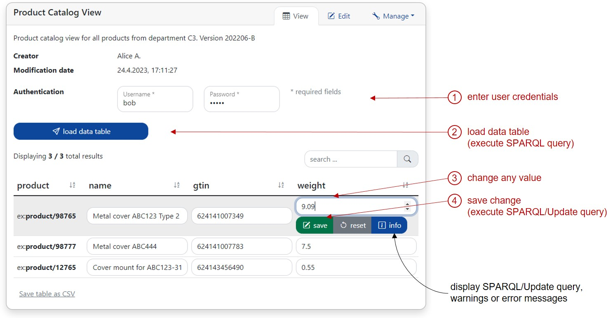
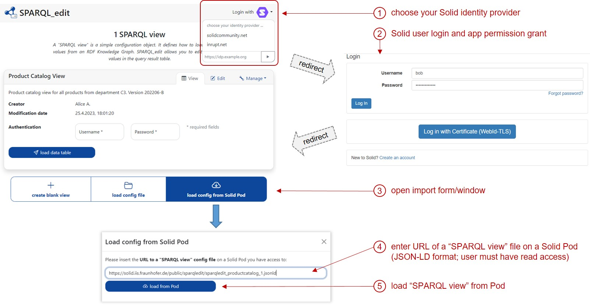
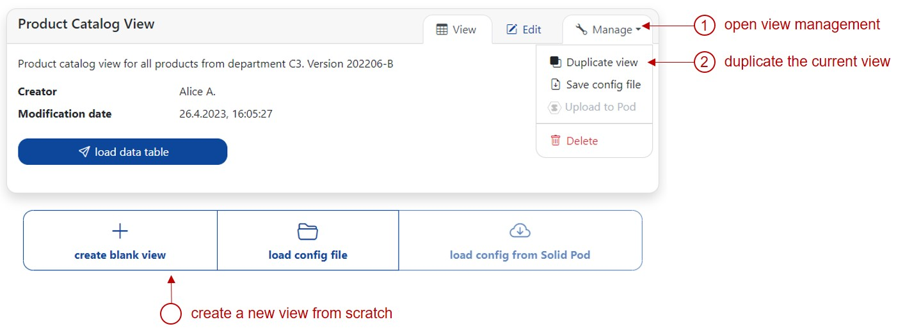
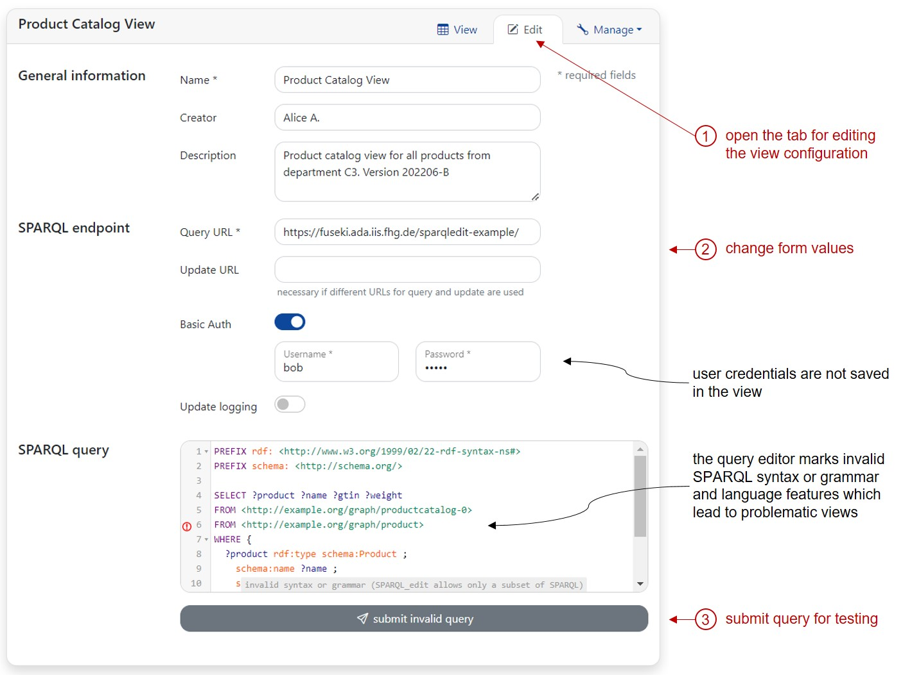

# SPARQL_edit tutorial

TODO: GitHub Pages

Open [https://sparqledit.netlify.app](https://sparqledit.netlify.app/) with Chrome or Firefox.

For this tutorial, SPARQL_edit comes with several "SPARQL views" by default. These "SPARQL view" examples are configured to query data from an [Apache Jena Fuseki](https://jena.apache.org/documentation/fuseki2/) triple store hosted at [TODO](TODO).

Please use on of these user credentials:
* bob / bobpw
* alice / alicepw

## Lay user perspective

Lay or business users open ready-to-use "SPARQL views" that have been created by experts colleagues. A "SPARQL view" is a simple configuration text file which defines how to load a table of values from an RDF Knowledge Graph. With this "SPARQL view", data from the Knowledge Graph is displayed in a table where certain values can be changed.

### Update RDF literal value

Steps for updating an RDF literal value with an existing "SPARQL view".

### "SPARQL view" from Solid Pod

Steps for loading a new "SPARQL view" (configuration file) from a Solid Pod.
Alternatively, a "SPARQL view" configuration file can be loaded from disk.

## Expert user perspective

Expert users create and test "SPARQL views" for their colleagues. "SPARQL view" configuration files are text files in the JSON-LD format. They can be uploaded to Solid Pods or distributed as files.

### Create new "SPARQL view"

You can create a new "SPARQL view" from scratch or by cloning an existing view configuration.

### Edit a "SPARQL view"

New or existing "SPARQL views" can be edited in the "edit" tab.

Important notes:
* user credentials are not saved in the view; the view only contains a flag if HTTP Basic Auth is necessary for this SPARQL endpoint
* the query editor marks invalid SPARQL syntax, grammar and language features which lead to problematic views
  * invalid SPARQL queries can be submitted anyway (because views are created by expert users)
  * if the query contains language features which are not supported by SPARQL_edit, RDF literal updates in the view will fail at some point

### Upload to Solid Pod

The upload of a "SPARQL view" to a Solid Pod is similar to the steps for loading a view from a Pod. After the Solid login, the option "Upload to Pod" is available in the management tab ("Manage") of each view. This function opens a form for uploading the selected view to a specific container of a Solid Pod. The Solid user must have write permissions for this container.